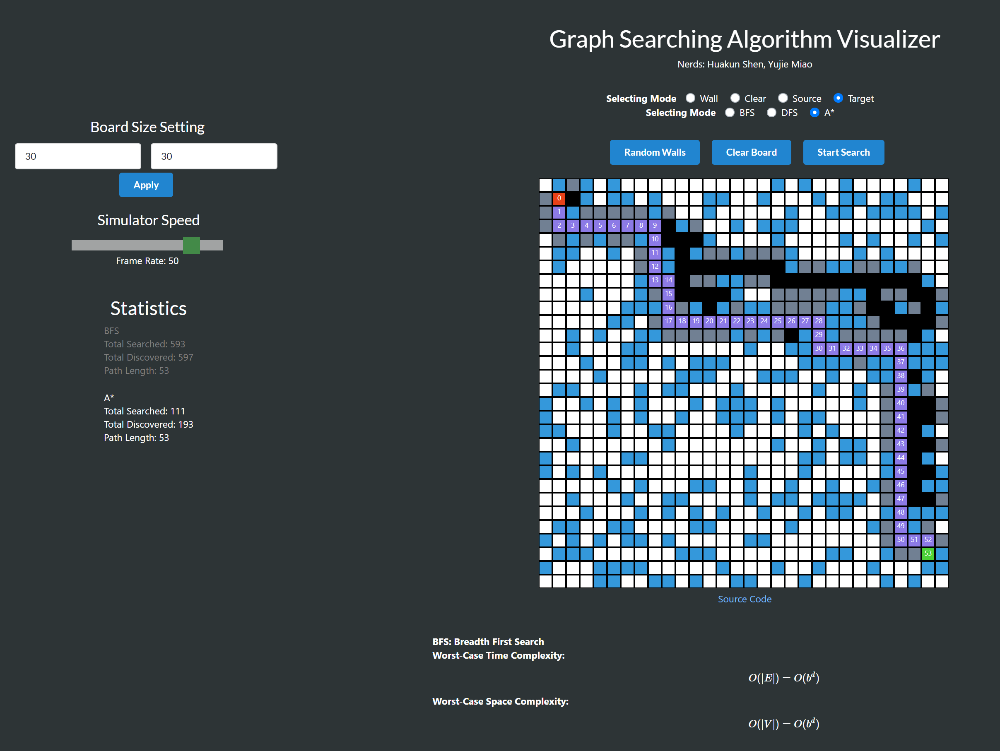
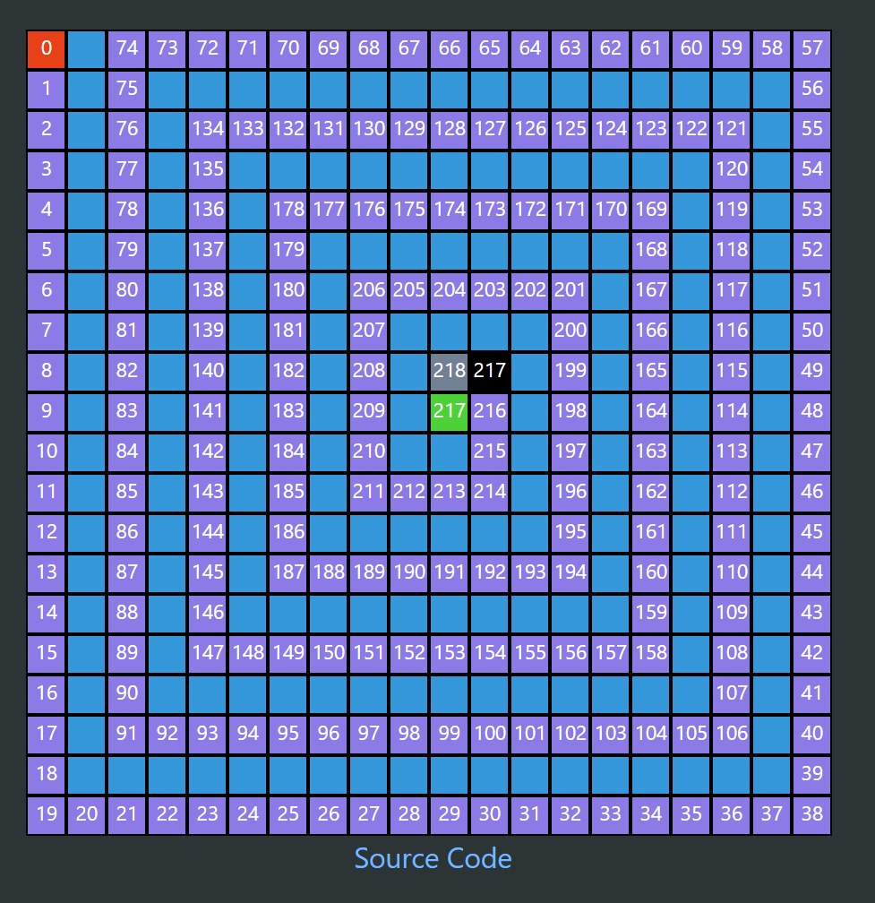

# GraphSearchVisualizer_Web

## https://huakunshen.github.io/GraphSearchVisualizer/

A visualizer for BFS, DFS and A* search.

User can 

* set map size up to 150 x 150 cells
* control simulator speed
* see statistic for each round of search to compare the speed and cost of different search algorithm on the same map
* see theoretical time and space complexity at the bottom of the page

1. set a source node
2. set a target node
3. select `Wall` in radio buttons to set walls
4. select `Clear` to clear any misplaced wall
5. or click `Random Walls` to set walls randomly. A prompt will ask user to input percentage of wall in the map (0-100). 100 means every node is a wall. 0 means no wall at all.
6. select a search algorithm
7. click `Start Search`
8. click `Step` or `Animation`, to proceed the simulator. `Step` proceed the animation step by step for user to see details of how the algorithm works.
9. `Clear Board` is used to reset the board.
10. After a search is done, you could also restart search on the same map by clicking `Start Search`

